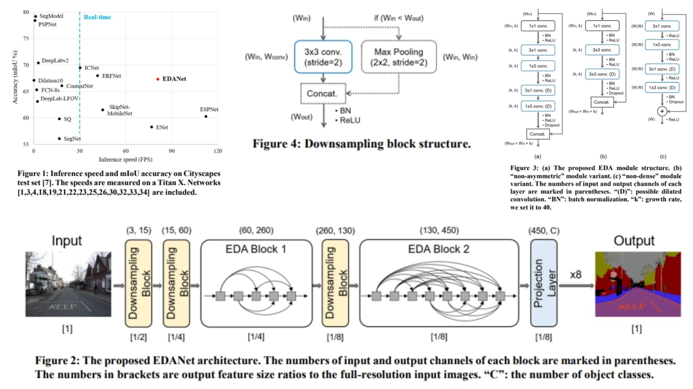

# 📹 EDANet-Replication

This repository provides a **faithful PyTorch replication** of the **EDANet architecture (Efficient Dense Modules with Asymmetric Convolution)** for **real-time semantic segmentation**. The implementation reconstructs the full pipeline from the original paper, including **EDA modules, asymmetric convolution factorization, dilated asymmetric convolution, dense connectivity, and lightweight downsampling design**.

Paper reference: *Efficient Dense Modules of Asymmetric Convolution for Real-Time Semantic Segmentation*  https://arxiv.org/abs/1809.06323

---

## Overview 🜃



> EDANet improves real-time segmentation efficiency by combining **asymmetric convolution factorization**, **dense feature reuse**, and **progressive receptive field expansion via dilated convolutions**, while avoiding heavy decoder or context modules.

Key ideas:

- **EDA Module**: core unit combining 1×1 compression + asymmetric + dilated asymmetric convolutions  
- **Asymmetric Convolution Factorization**: replaces $$n \\times n$$ kernels with $$n \\times 1$$ and $$1 \\times n$$ for efficiency  
- **Dense Connectivity (module-level)**: feature reuse via concatenation instead of re-computation  
- **Dilated Asymmetric Convolution**: enlarges receptive field without increasing parameter cost  

---

## Core Math 📐

**Asymmetric convolution decomposition:**

$$
W * I \;=\; (W_x * (W_y * I))
$$

where:
- $$W_x$$ → horizontal 1D kernel  
- $$W_y$$ → vertical 1D kernel  


**Dilated receptive field:**

$$
n_r = r (n - 1) + 1
$$


**Dense connectivity formulation:**

$$
x_{l+1} = [x_l, F_l(x_l)]
$$


**EDA module output growth:**

$$
C_{out} = C_{in} + k
$$

---

## Why EDANet Matters 🜄

- Reduces computation by replacing $$n \\times n$$ convolutions with factorized asymmetric operations  
- Maintains accuracy via dense feature reuse instead of deep decoders  
- Expands receptive field progressively using dilated asymmetric convolution  
- Designed for **real-time semantic segmentation scenarios (edge / robotics / autonomous systems)**  

---

## Repository Structure 🏗️

```bash
EDANet-Replication/
├── src/
│   ├── blocks/
│   │   ├── eda_module.py
│   │   ├── asymmetric_conv.py
│   │   ├── dilated_asymmetric_conv.py
│   │   ├── pointwise_conv.py
│   │   └── downsampling.py
│   │
│   ├── modules/
│   │   └── eda_block.py
│   │
│   ├── model/
│   │   └── edanet.py
│   │
│   └── config.py
│
├── images/
│   └── figmix.jpg
│
├── requirements.txt
└── README.md
```

---

## 🔗 Feedback

For questions or feedback, contact:  
[barkin.adiguzel@gmail.com](mailto:barkin.adiguzel@gmail.com)
